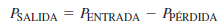

# INFORME-DE-TAREA-2

CAPITULO 3 Y 4
OBJETIVOS:
Objetivo General: Resolver los ejercicios acerca de la ley de Ohm, y de Potencia y Energía, utilizando la materia del libro guía, para poder resolver problemas relacionados a los circuitos.
Objetivos específicos:
-	Resolver ejercicios sobre la Ley de Ohm, para conocer el comportamiento de voltaje, resistencia y corriente dentro de un circuito
-	Resolver ejercicios de Potencia y Energía, para establecer condiciones en donde el circuito pueda funcionar de manera correcta
-	Determinar las unidades esenciales que funcionan en cada ley, para desarrollar de manera correcta los ejercicios propuestos.

# MARCO TEÓRICO (RESUMEN)

La Ley de Ohm enuncia que el voltaje es directamente proporcional a la corriente del circuito, e inversamente proporcional a la resistencia total del circuito.

 
La relación lineal de corriente y voltaje
Se entiende por “lineal” que, si la corriente del circuito se incrementa en cierto porcentaje, el voltaje también lo hará, y viceversa; esto ocurre siempre y cuando se considere a la resistencia como constante.

 
La relación inversa de corriente y resistencia
Mientras la corriente se incrementa, la resistencia se reduce, y viceversa. Esto ocurre siempre y cuando el Voltaje sea constante.

 
Unidades con prefijos métricos
Siempre se utilizarán las unidades con diferentes prefijos métricos, dependiendo de la cantidad que se esté manejando en los ejercicios. Son ejemplos: mA (miliamperios), KΩ (kilo ohmios), uV (micro voltios), etc.
Localización de fallas
Es la corrección de un funcionamiento defectuoso del circuito. Se compone de tres fases: análisis, planificación, y medición.
	Análisis: Trabaja tratando de responder a preguntas como:
	¿Alguna vez funcionó el circuito?
	Si ha funcionado con anterioridad, ¿En qué condiciones falló?
	¿Cuáles son los síntomas de la falla?
	¿Cuáles son las posibles causas de la falla?
	Planificación: Consiste en armar un plan lógico de ataque. La mejor manera es utilizando el razonamiento.
	Medición: Se realizan mediciones en el circuito minuciosamente, para comprobar que esté en funcionamiento.
Comparación de mediciones de V, R e I
	Para medir voltaje, el voltímetro debe estar conectado en paralelo a través del componente.
	Para medir corriente, el amperímetro debe estar conectado en serie con el componente.
	Para medir resistencia, el óhmetro se debe colocar a través del componente, previamente haber retirado el componente del circuito.
ENERGÍA Y POTENCIA
Energía es la capacidad de hacer trabajo, potencia es la razón de cambio de la energía con respecto al tiempo.

 
*No hay que confundir el uso de la W cursiva, que se usa para representar energía en forma de trabajo, y la W normal, que es la potencia del sistema

La unidad de energía kilowatt-hora (kWh)
Dado que la potencia se expresa en watts y el tiempo en segundos, se pueden utilizar unidades de energía llamadas watt-segundo (Ws), watt-hora (Wh), y kilowatt-hora (kWh).
 
 
 
 
Potencia en un circuito eléctrico
En un circuito eléctrico, la cantidad de potencia disipada depende de la cantidad de resistencia y de corriente
 

Sus variaciones son las siguientes:

 				 
La relación entre potencia y corriente, voltaje, y resistencia expresada en las fórmulas precedentes se conoce como ley de Watt.

POTENCIA NOMINAL EN RESISTORES
Es la cantidad máxima de potencia que un resistor puede disipar a causa de un calentamiento excesivo del mismo. Su módulo no depende de la resistencia, sino de las características físicas del resistor.
Si un resistor recibe más potencia de la que puede manejar, puede quemarse, o directamente variar su índice de resistencia.

CONVERSIÓN DE ENERGÍA Y CAÍDA DE VOLTAJE EN UNA RESISTENCIA

 
Cada vez que los electrones entran en una resistencia, liberan parte de su energía dentro de la resistencia. Por eso, los electrones poseen más energía cuando entran en una resistencia que cuando salen. Al finalizar el recorrido, los electrones se encuentran con su nivel energético más bajo.
FUENTES DE POTENCIA
Es un dispositivo que provee potencia a una carga. La carga puede ser cualquier cosa desde un foco hasta una computadora. El producto IVSALIDA es la cantidad de potencia producida por la fuente y consumida por la carga. Para un voltaje de salida dado (VSALIDA), más corriente absorbida por la carga significa más potencia de la fuente.

 
AMPERES-HORA NOMINALES DE BATERÍAS
Los amperes-hora nominales determinan el tiempo durante el cual una batería puede suministrar cierta cantidad de corriente promedio hacia una carga a voltaje nominal. Mientras más corriente debe suministrar la batería, más corta es su duración.

EFICIENCIA DE UNA FUENTE DE POTENCIA
Es la relación entre la potencia que sale de un circuito, y la que entra en el circuito.

 

La potencia de salida siempre es menor que la de entrada porque una parte de la potencia total debe ser utilizada internamente para operar los circuitos de la fuente de potencia. A esta disipación de potencia interna se le llama normalmente pérdida de potencia.
 

# Resolución de ejercicios

SECCIÓN 3–1 La relación de corriente, voltaje y resistencia
1. En un circuito compuesto de una fuente de voltaje y un resistor, describa qué le sucede a la corriente
cuando
(a) el voltaje se triplica
(b) el voltaje se reduce en 75%
(c) la resistencia se duplica
(d) la resistencia se reduce en 35%
(e) el voltaje se duplica y la resistencia se reduce a la mitad
(f) el voltaje y la resistencia se duplican
a) V1=I1*R1
     V2=3V1
     V2=3(I1*R1)
Por lo tanto, la resistencia y la corriente aumentan 3 veces
b) V1=I1*R1
     V2=V1/100*35%
     I2*R2=(I1*R1)/(100%)*35%
     I2*R2*100/35=I1*R1

Por lo tanto, el producto entre Intensidad y resistencia aumenta 35%
c) V1=I1*R1
V2=I1*2R1;   V2/2=V1;  V2=2V1
Por lo tanto, el voltaje se reduce a la mitad
d) V1=I1*R1
V2=I1*R1/100*35%
100/35 V2=V1
Por lo tanto, el voltaje aumenta 100/35 veces
e) V1=I1*R1
V2=2V1
V2=(I1*R1/2)/2=(I1*R1)/4
4 V2/R1=I1
Por lo tanto, la corriente aumenta 4 veces
f) V1=I1*R1
V2=2V1;   R2=2R1
V2=I2*R2;  2V1=I2*2R1
Por lo tanto, la corriente no cambia

3. Enuncie la fórmula utilizada para encontrar V cuando los valores de I y R son conocidos.
El voltaje de la corriente es igual a la cantidad de corriente por la resistencia total del circuito.

5. Se conecta una fuente de voltaje variable al circuito de la figura 3-18. Comience con 0 V e incremente el voltaje, en pasos de 10 V, hasta 100 V. Determine la corriente en cada voltaje y trace una gráfica de V contra I. ¿Es la gráfica una línea recta? ¿Qué indica la gráfica?

 

Voltaje	Intensidad
0 V	0 A
10 V	0,1 A
20 V	0.2 V
30 V	0.3 V
40 V	0.4 A
50 V	0.5 A
60 V	0.6 A
70 V	0.7 A
80 V	0.8 V
90 V	0.9 V
100 V	1 A
I=V/100

 
La gráfica indica que la intensidad crece de manera constante

7. La figura 3-19 es una gráfica de corriente contra voltaje para tres valores de resistencia. Determine R1, R2 y R3.
 
R1=V1/I1=2V/4A=0,5Ω                            R2=V2/I2=3V/3A=1Ω                             R3=V3/I3=6V/3A=2Ω

9. Trace la relación corriente-voltaje para un resistor de cinco bandas con código de colores café, verde, gris, café, rojo.
Café=1
Verde=5
Gris=8
Rojo(tolerancia)= ±2% 

Por lo tanto, la resistencia es de 1580 Ω                            I=V/1580Ω
 

11. Se mide la corriente en un circuito que opera con una batería de 10 V. El amperímetro lee 50 mA. Más tarde, se observa que la corriente cae a 30 mA. Eliminando la posibilidad de un cambio de resistencia, debe concluirse que el voltaje ha cambiado. ¿Cuánto ha cambiado el voltaje de la batería y cuál es su nuevo valor?
R1=R2
R1=(10 V)/(50 mA);               R2=V2/(30 mA)
(10 V)/(50 mA)=V2/(30 mA);         V2=(10 V*30 mA)/(50 mA);             V2=6V
13. Trace una gráfica de corriente contra voltaje con valores de voltaje que vayan de 10 a 100 V, en incrementos de 10 V, para cada uno de los siguientes valores de resistencia:
a) 1 Ω		b) 5 Ω		c) 20 Ω		d)100 Ω

I=V/(1 Ω)                               I=V/5Ω                                I=V/(20 Ω)                             I=V/(100 Ω)

 			 

 			 

Cálculo de la corriente
15. Determine la corriente en cada caso:
a) V=5V, R= 1.0 Ω	b) V=15V, R= 10 Ω	c) V=50V, R=100 Ω
d) V=30V, R= 15k Ω	e) V=250 V, R=5.6M Ω

a) I=5V/(1 Ω)=5A        b)I=15V/10Ω=1,5 A       c)I=50V/(100 Ω)=0,5 A

d)I=30V/(15 kΩ)=2mA          e)I=250V/(5.6 MΩ)=44.64 uA                

17. Se conecta un resistor de 10 Ω a través de una batería de 12 V. ¿Cuál es la corriente a través del resistor?

I=V/R=12V/10Ω=1.2 A

19. Se conecta un resistor de cuatro bandas a través de las terminales de una fuente de 25 V. Determine la corriente del resistor si el código de colores es amarillo, violeta, naranja, plata.
Amarillo=4
Violeta=7
Naranja=3
Plata=±10% 
Por lo tanto, la resistencia es de 47000 Ω
I=V/R=25V/(47 kΩ)=0,53 mA

21. Si el voltaje del problema 20 se duplica, ¿se fundirá un fusible de 0.5 A? Explique su respuesta.
20. Se conecta un resistor de 5 bandas a través de una fuente de 12 V. Determine la corriente si el código de colores es naranja, violeta, amarillo, oro, café.

Naranja=3
Violeta=7
Amarillo=4
Oro=0.1 Ω
Café=±1%

Resistencia=37,4 Ω

I=V/R=(24 V)/(37,4 Ω )=0.64 A
Por lo tanto, si se fundiría, porque el circuito genera más corriente que la corriente que puede soportar el fusible.

Cálculo de voltaje
23. Calcule el voltaje para cada valor de I y R:
a) I=2A, R=18 Ω		b)I=5A, R=56 Ω		c) I=2.5A, R=680 Ω
d) I=0.6 A, R=56 Ω	e) I=0.1 A, R=560 Ω 

a) V=I*R=2A*18Ω=36 V
b) V=I*R=5A*56Ω=280 V
c) V=I*R=2.5 A*680 Ω=1700 V
d) V=I*R=0.6 A*56 Ω=33.6 V
e) V=I*R=0.1 A*560 Ω=56 V

25. Se leen tres amperes de corriente a través de un resistor de 27 Ω  conectado a una fuente de voltaje. ¿Cuánto voltaje produce la fuente?
V=I*R=3A*27 Ω=81 V

27. Se conecta una fuente de 6 V a un resistor de 100 Ω mediante dos tramos de alambre de cobre calibre 18 de 12 pies de largo. La resistencia total es la resistencia de los dos alambres sumada al resistor de 100 Ω. Determine lo siguiente:
(a) Corriente
(b) Caída de voltaje en el resistor
(c) Caída de voltaje a través de cada tramo de alambre
Calibre 18:
Resistencia=6.38 Ω
Área= 1624,3

R_T=100Ω+6.38Ω=106.38Ω
A) I=V/R=6V/106.38Ω=0.0564A
B) V=I*R=0.0564 A*100Ω=5.64V
C) V=I*R=0.0564 A*6.38 Ω=0.36V

29. Calcule la resistencia de un reóstato para cada juego de valores de V e I:  (I=V/R)
A) V = 10 kV, I = 5 A
R=V/I
R=10 kV/5A
R=2KΩ
B) V= 7 V, I = 2 mA
R=V/I
R=7 V/2 mA
R=3.5KΩ
C) V = 500 V, I = 250 mA
R=V/I
R=500 V/250 mA
R=2KΩ
D) V = 50 V, I = 500 µA
R=V/I
R=50 V/500 µA
R=100KΩ
E) V = 1 kV, I = 1 mA
R=V/I
R=1 kV/1 mA
R=1MΩ
31. En el circuito de la figura 3-23(a), el filamento de una lámpara tiene cierta cantidad de resistencia, la cual está representada por una resistencia equivalente en la figura 3-23(b). Si la lámpara opera con 120 V y 0.8 A de corriente, ¿cuál es la resistencia de su filamento cuando está encendida?
R=V/I
R=120 V/0.8 A
R=150Ω
33. Al variar el reóstato (resistor variable) en el circuito de la figura 3-24, puede cambiar la cantidad de corriente. El ajuste del reóstato es tal que la corriente es de 750 mA. ¿Cuál es el valor de resistencia de este ajuste? 
R=V/I
R=100 V/750 mA
R=133.33Ω

Para ajustar la corriente a 1 A, ¿a qué valor de resistencia debe ajustar el reóstato? ¿Cuáles el problema con el circuito?
R=V/I
R=100 V/1A
R=100Ω
Observamos que si sube la corriente la resistencia disminuye por lo cual esto puede ocasionar un cortocircuito ya que la resistencia disminuye. 
35. Repita el problema 34 con un circuito de 110 V y un fusible de 1 A.
R=110 V/1 A
R=110Ω-15Ω
R=95Ω
La resistencia que todavía puede soportar en serie para no quemar el fisible es <95Ω

37. Suponga que tiene una serie de 32 luces y uno de los focos se fundió. Con el método de división a la mitad, y comenzando por la mitad izquierda del circuito, ¿cuántas lecturas de resistencia tomará localizar el foco fundido si es el décimo séptimo de izquierda a derecha?
	Dividir en 2 circuitos la cual podemos medir con la ayuda del multímetro la reincida de estos dos circuitos y ya que uno de estas resistencias no funciona no cerrara el circuito por ende no dará ningún valor de resistencia. En el circuito que no dio valores dividir otra vez en la mitad y asi hasta encontrar la falla del mismo. 
Capítulo 4 
1. Demuestre que la unidad de potencia (el watt) equivale a un volt por un ampere.
P=V/A [watt]
V=([JOULES])/([COULOMB])
I=([COULOMB])/([TIEMPO])
V*I=[JOULES]/[COULOMB] *[COULOMB]/[TIEMPO] =[JOULES]/[TIEMPO] [watt]
1 julio por segundo. El vatio o Watt mide la velocidad a la que puede transformarse la energía.
3. ¿Cuál es la potencia cuando se consume energía a razón de 350 J/s?
P=(350 J)/1s
P=350watt
5. ¿A cuántos watts equivalen 1000 J en 50 ms?
P=(1000 J )/(50 ms)
P=20kwatt
7. Convierta las siguientes cantidades en mega watts:
A) 1,000,000 W
1W=1*10^(-6) MW
mega watt=(1,000,000 W* 1*10^(-6) MW)/1W
mega watts=1MW
B) 3*10^6 W
1W=1*10^(-6) MW
mega watt=(3*10^6  W* 1*10^(-6) MW)/1W
mega watts=3MW
C)15*10^7W
1W=1*10^(-6) MW
mega watt=(17*10^7  W* 1*10^(-6) MW)/1W
mega watts=170MW
D)8700KW
1KW=1*10^(-3) MW
mega watt=(8700KW* 1*10^(-3) MW)/1KW
mega watts=8,7MW
9. Convierta las siguientes cantidades en microwatts:
A) 2W
1W=1*10^6µW
micro watt=(2W* 1*10^6µW)/1W
micro watts=2000000µW
B) 0.0005W
1W=1*10^6µW
micro watt=(0.0005W* 1*10^6µW)/1W
micro watts=500µW
C)0.25mW
1mW=1*10^3µW
micro watt=(0.25mW* 1*10^3µW)/1mW
micro watts=250µW
D) 0.00667mW
1mW=1*10^3µW
micro watt=(0.00667mW* 1*10^3µW)/1mW
micro watts=6.67µW
11. Un dispositivo electrónico en particular utiliza 100 mW de potencia. Si funciona durante 24 h, ¿cuántos joules de energía consume?
P=([J])/([s])
100 mW =([J])/24h
24h*60m/1h*60s/1m=86400s
100 mW =([J])/86400s
[J]=86400s*0.1 W
[J]=8640J
13. Al final de un periodo de 31 días, su recibo de electricidad muestra que utilizó 1500 kWh. ¿Cuál fue su consumo de potencia diario promedio? R=2.02 kW/día
P=[J]/[s] 
1500 kW/h*24h/1dia=36000 kW/h
31 dias   --→   36000 kW/h
24h   --→   ?
kW/día=(24h*36000 kW/h)/(31 dias)
kW/día=(24h*36000 kW/h)/(31 dias)
kW/día=2.78  kW/dia

15.  Convierta 6700 watts-segundos en kWh.

6700 W/s * (1kW/1000W)* (3600 s/1 h)= 24120  KW/h

17.  Si una fuente de 75 V está suministrando 2 A a una carga, ¿cuál es el valor de resistencia de la carga?

RT= 75V/2A =37,5 Ω

19.  Un calentador eléctrico funciona con 120 V y absorbe 3 A de corriente. ¿Cuánta potencia utiliza?

P= 120 V * 3A = 360 W

21. Calcule la potencia disipada por un resistor de 10 kΩ que transporta 100 µA.

P= (100 µA )^2 * 10 kΩ = 1x10^12W

23. Se conecta un resistor de 56 Ω entre las terminales de una batería de 1.5 V. ¿Cuál es la disipación de potencia en el resistor?

P= (1,5)^2/56Ω = 0,04017 w

25.  Una fuente de 12 V se conecta entre los extremos de un resistor de 10 Ω.
(a) ¿Cuánta energía se utiliza en dos minutos?

P=  (12V)^2/10Ω = 14,4 W
J=(14,4)*(2 m)
J=(14,4)*(120)
J= 1728 Joules

(b) Si después de un minuto se desconecta el resistor, ¿es la potencia durante este primer minuto mayor, menor o igual a la potencia que hay durante un intervalo de dos minutos?
Su potencia es igual ya que no cambia, lo que cambia es la energía que pasa por el conductor, le cambio del tiempo no es dependiente de la potencia.

27. Cierto tipo de resistor viene en las siguientes clasificaciones: 3 W, 5 W, 8 W, 12 W, 20 W. Una aplicación en particular requiere de un resistor que pueda manejar aproximadamente 8W. ¿Qué clasificación utilizaría usted para tener un margen de seguridad mínimo del 20% sobre el valor nominal? ¿Por qué?
3w<5w<8w<12w
El 20% de seguridad es una diferencia de 4 W y lo más seguro sería el límite de 3w y 12w.

29. Una carga de 50 Ω utiliza 1 W de potencia. ¿Cuál es el voltaje de salida de la fuente de potencia?

V= sqrt(50Ω * 1W)= 7,07 V

31. ¿Cuál es la energía total en joules que suministra la batería del problema 30 durante 90 horas?

Voltaje= 1,25 V
Resistencia = 10 Ω
P= (1,5v)^2/10 Ω =0,225 W
J=0,225 * 324000= 72900 Joules

33. ¿Cuánta corriente promedio puede ser absorbida de una batería de 80 Ah durante 10 h?

Intensidad de corriente es 8A durante 10 horas.

35. Si la potencia de entrada es de 500 mW y la de salida de 400 mW, ¿cuánta potencia se pierde? ¿Cuál es la eficiencia de esta fuente de potencia?

Pp=Pe-Pu= 500mW – 400mW= 100mW

Eficiencia = (400mW)/500mW = 0,8 = 80% de eficiencia

37.  Cierta fuente de potencia suministra 2 W de forma continua a una carga. Está operando al 60% de eficiencia. En un periodo de 24 h, ¿cuántos kilowatts-hora utiliza la fuente de potencia?
 Suministro de potencia= 2W
60% de eficiencia
Tiempo: 24 h
P=0,6 * 2W= 1,2 W

# VIDEO

# Conclusiones

# Bibliografia

